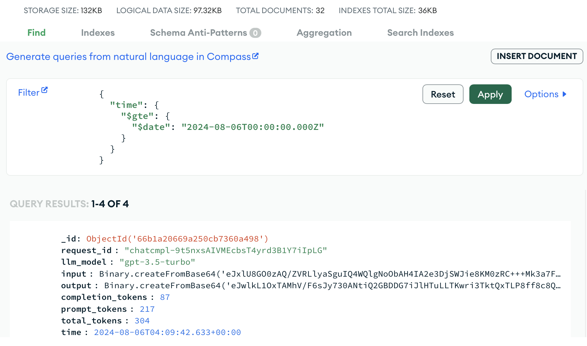

<h1>
  
  <p align="center">
	Loggify-LLM
  </p>
</h1>

<p align="center">
    

<a href="./notebooks/example.ipynb">
        
    </a>
</p>

Loggify-LLM is a robust logging module designed to capture and manage API requests for large language models. Enhance your project's observability and debugging capabilities with seamless request tracking and detailed logging.

## Table of Contents

- [Update](#update)
- [Quickstart](#quickstart)
- [Contributing](#contributing)

## Update
- [TBD]: Support more LLM APIs providers.
- **August 12th, 2024**: Support for the Batch API to OpenAI inference, reducing costs by half.
- **August 1st, 2024**: Track OpenAI API usage for both text [`ChatOpenAI`](/loggify_llm/chat/chat_openai.py) and vision [`ChatOpenAIVision`](/loggify_llm/chat/chat_openai.py) requests.

## Quickstart

The structure of source code:

```
├── LICENSE            <- Open-source license if one is chosen
├── Makefile           <- Makefile with convenience commands like `make data` or `make train`
├── README.md          <- The top-level README for developers using this project.
├── notebooks          <- Jupyter notebooks. Naming convention is a number (for ordering),
│                         the creator's initials, and a short `-` delimited description, e.g.
│                         `1.0-jqp-initial-data-exploration`.
│
├── pyproject.toml     <- Project configuration file with package metadata for loggify_llm
├── requirements.txt   <- The requirements file for reproducing the analysis environment, e.g.
│                         generated with `pip freeze > requirements.txt`
│
├── setup.cfg          <- Configuration file for flake8
│
└── loggify_llm                <- Source code for use in this project.
    │
    ├── __init__.py    <- Makes loggify_llm a Python module
```

Let’s install the library

```bash
git clone https://github.com/taindp98/Loggify-LLM.git
cd Loggify-LLM
pip install -r requirements.txt
```

**Prerequisite**: Setting Up MongoDB Atlas

Before proceeding with this repository, please ensure you have set up your own `MongoDB Atlas` cluster. This project requires access to a MongoDB database for data storage and retrieval. Follow these steps to create your MongoDB Atlas cluster:

1. **Sign Up/Log In to MongoDB Atlas:**
   - Go to the [MongoDB Atlas website](https://www.mongodb.com/cloud/atlas).
   - Sign up for a new account or log in to your existing account.

2. **Create a New Cluster:**
   - Click on "Build a Cluster" and select the free tier or any plan that suits your needs.
   - Choose your preferred cloud provider and region.

3. **Configure Your Cluster:**
   - Follow the prompts to configure your cluster settings.
   - Once configured, click "Create Cluster."

4. **Add Your IP Address:**
   - In the Security section, click on "Network Access" and add your IP address to the whitelist.

5. **Create a Database User:**
   - In the Security section, click on "Database Access" and create a new database user with appropriate permissions.

6. **Connect to Your Cluster:**
   - Once your cluster is ready, click on "Connect" and choose a connection method.
   - Copy the connection string provided and replace `<username>`, `<password>`, and `<your-cluster-url>` with your database user credentials and cluster URL.

7. **Update Configuration in This Repository:**
   - Replace the placeholder connection string in the project's configuration file with your MongoDB Atlas connection string.

By completing these steps, you'll ensure that your MongoDB Atlas cluster is ready for use with this project. If you need further assistance, please refer to the [MongoDB Atlas documentation](https://docs.atlas.mongodb.com/).

Create the `.env` file containing `OPENAI_API_KEY` the connection to the `MongoDB Atlas`

```
## OPENAI
OPENAI_API_KEY=sk-***

## MONGODB
COLLECTION_NAME=<your-collection-name>
DB_NAME=<your-database-name>
CLUSTER_ADDRESS=<your-cluster-ip-address>
USRNAME=<provided-user-name>
PASSWD=<provided-password>
```

An example for logging a certain LLM request:

```python
from loggify_llm.chat.chat_openai import ChatOpenAI

llm = ChatOpenAI()

system_prompt = """
    You possess in-depth knowledge of natural images and can describe them with ease. \
    From the given input text indicating the category name of a certain object, your task involves the following steps:
    1-Imagine a scene containing the input object.
    2-Generate 4 descriptions about different key appearance features of the input object from the imagined scene, with each description having a maximum of 16 words.
    3-Output a JSON object containing the following key:
        "description": <list of 4 descriptions>

    Use the following examples:
        Input text: "sea lion"
        Answer: "description": ["A round-bellied seal sits on a rock, looking intently at something off-camera.", "The seal lies with flippers tucked, sleek body well-maintained.", "The seal's thick, smooth fur and large dark eyes show alertness and curiosity.", "Turquoise water contrasts with the seal's brown fur and grey rock, highlighting its natural environment."]
"""
response = llm.request(system_prompt=system_prompt, user_prompt="British shorthair")
print(response)
```

the output follows:

```bash
🔥 Successfully Log Request to Database
{
  "request_id": "chatcmpl-9t5nxsAIVMEcbsT4yrd3B1Y7iIpLG",
  "llm_model": "gpt-3.5-turbo-instruct",
  "input": [
    {
      "role": "system",
      "content": "\n    You possess in-depth knowledge of natural images and can describe them with ease. From the given input text indicating the category name of a certain object, your task involves the following steps:\n    1-Imagine a scene containing the input object.\n    2-Generate 4 descriptions about different key appearance features of the input object from the imagined scene, with each description having a maximum of 16 words.\n    3-Output a JSON object containing the following key:\n        \"description\": <list of 4 descriptions>\n\n    Use the following examples:\n        Input text: \"sea lion\"\n        Answer: \"description\": [\"A round-bellied seal sits on a rock, looking intently at something off-camera.\", \"The seal lies with flippers tucked, sleek body well-maintained.\", \"The seal's thick, smooth fur and large dark eyes show alertness and curiosity.\", \"Turquoise water contrasts with the seal's brown fur and grey rock, highlighting its natural environment.\"]\n"
    },
    {
      "role": "user",
      "content": "British shorthair"
    }
  ],
  "output": {
    "description": [
      "A fluffy British Shorthair cat lounges on a cozy armchair, eyes half-closed in contentment.",
      "Its round face and chubby cheeks give it an adorable, teddy bear-like appearance.",
      "The cat's dense, plush coat is a striking blue-gray color, adding to its charm.",
      "Large, round eyes in shades of copper or gold exude a calm and gentle expression."
    ]
  },
  "completion_tokens": 87,
  "prompt_tokens": 217,
  "total_tokens": 304
}
```

Dashboard of MongoDB should be looked like



## Contributing

All contributions are welcome.


